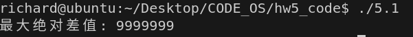

# 作业五
[姓名：蔡合森] [学号：2022K8009909004]
**5.1**写一个两线程程序，两线程同时向一个数组分别写入1000万以内的奇数和偶数，写入过程中两个线程共用一个偏移量index，代码逻辑如下所示。写完后打印出数组相邻两个数的最大绝对差值。 
```C
int MAX=10000000;
index = 0
//thread1 
for(i=0;i<MAX;i+=2) {
data[index] = i; //even ( i+1 for thread 2) 
index++;
}
//thread2 
for(i=0;i<MAX;i+=2) {
data[index] = i+1; //odd 
index++;
}
```
请分别按下列方法完成一个不会丢失数据的程序: 
1) 请用 Peterson 算法实现上述功能;
2) 请学习了解 pthread_mutex_lock/unlock()函数, 并实现上述功能;
3) 请学习了解__atomic_add_fetch (gcc > 4.7)或者C++中的std::atomic类型和fetch_add函数, 并实现上述功能。
提交:
1.	说明你所写程序中的临界区（注意：每次进入临界区之后，执行200次操作后离开临界区。）
2.	提供上述三种方法的源代码，运行结果截图(即，数组相邻两个数的最大绝对差值) 
3.	请找一个双核系统测试三种方法中完成数组写入时，各自所需的执行时间，不用提供计算绝对差值的时间。
**解**：
1)
```C

```
结果如图：
