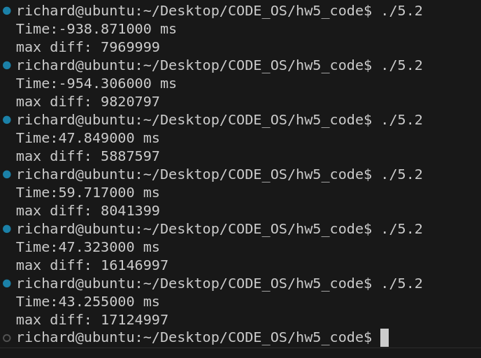

# 作业五
[姓名：蔡合森] [学号：2022K8009909004]
**5.1**写一个两线程程序，两线程同时向一个数组分别写入1000万以内的奇数和偶数，写入过程中两个线程共用一个偏移量index，代码逻辑如下所示。写完后打印出数组相邻两个数的最大绝对差值。 
```C
int MAX=10000000;
index = 0
//thread1 
for(i=0;i<MAX;i+=2) {
data[index] = i; //even ( i+1 for thread 2) 
index++;
}
//thread2 
for(i=0;i<MAX;i+=2) {
data[index] = i+1; //odd 
index++;
}
```
请分别按下列方法完成一个不会丢失数据的程序: 
1) 请用 Peterson 算法实现上述功能;
2) 请学习了解 pthread_mutex_lock/unlock()函数, 并实现上述功能;
3) 请学习了解__atomic_add_fetch (gcc > 4.7)或者C++中的std::atomic类型和fetch_add函数, 并实现上述功能。
提交:
1.	说明你所写程序中的临界区（注意：每次进入临界区之后，执行200次操作后离开临界区。）
2.	提供上述三种方法的源代码，运行结果截图(即，数组相邻两个数的最大绝对差值) 
3.	请找一个双核系统测试三种方法中完成数组写入时，各自所需的执行时间，不用提供计算绝对差值的时间。
**解**：
1)
```C
#include <stdio.h>
#include <stdlib.h>
#include <sys/time.h>
#include <pthread.h>
#include <unistd.h>


#define MAX 10000000
int data[MAX];
int ind_var = 0;
int flag[2];
int turn;


void* changedata(void* args){
    int start[2],end[2]={0, 0};
    int id = *(int*)args;
    while(ind_var<MAX){
        flag[id-1] = 1;  // ready for the critical section
        turn = id%2+1;    // give the other thread the priority
        while(flag[id-1] && turn==id){
            //critical section start
            if(ind_var>=MAX)    
            // check if the array is full
                pthread_exit(NULL);
            start[id-1] = end[id-1];
            end[id-1] =  start[id-1]+200;
            for(int i=start[id-1];i<end[id-1];i+=2) {
                data[ind_var] = i + id%2; 
                //insert  i+1 for thread 2
                ind_var++;
            }
            //critical section end
        }
        flag[id-1] = 0;
    }
    pthread_exit(NULL);
}

int main(){
    pthread_t t1,t2;
    struct timeval begin, end;
    int diff=-1;
    int id[] = {1, 2};
    gettimeofday(&begin, NULL);
    pthread_create(&t1, NULL, changedata, &id[0]);
    pthread_create(&t2, NULL, changedata, &id[1]);
    pthread_join(t1, NULL);
    pthread_join(t2, NULL);
    gettimeofday(&end, NULL);
    printf("Time: %lf ms \n", (double)(end.tv_usec - begin.tv_usec)/1000);
    for(int i=0;i<MAX-1;i++){
        if(data[i+1]-data[i]>diff)
            diff=data[i+1]-data[i];
        else if(data[i]-data[i+1]>diff)
            diff=data[i]-data[i+1];
    }
    printf("max diff: %d\n", diff);
}
```
结果如图：
(2)
```C
#include <unistd.h>
#include <stdio.h>
#include <stdlib.h>
#include <sys/time.h>
#include <pthread.h>

#define MAX 10000000
int data[MAX];
int ind_var = 0;
pthread_mutex_t mutex ; 

void* changedata(void* args){
    int start[2],end[2]={0, 0};
    int id = *(int*)args;
    while(ind_var<MAX){
            pthread_mutex_lock(&mutex);  
            //lock the mutex
            //critical section start
            start[id-1] = end[id-1];
            end[id-1] =  start[id-1]+200;
            for(int i=start[id-1];i<end[id-1];i+=2) {
                data[ind_var] = i + id%2; //insert i+1 for thread 2
                ind_var++;
            }
            //critical section end
            pthread_mutex_unlock(&mutex); 
            //unlock the mutex
    
    }
    pthread_exit(NULL);
}

int main(){
    pthread_t t1,t2;
    struct timeval begin, end;
    int delta=-1;
    int id[] = {1, 2};
    gettimeofday(&begin, NULL);
    pthread_create(&t1, NULL, changedata, &id[0]);
    pthread_create(&t2, NULL, changedata, &id[1]);
    pthread_join(t1, NULL);
    pthread_join(t2, NULL);
    gettimeofday(&end, NULL);

    for(int i=0;i<MAX-1;i++){
        if(data[i+1]-data[i]>delta)
            delta=data[i+1]-data[i];
        else if(data[i]-data[i+1]>delta)
            delta=data[i]-data[i+1];
    }
    printf("Time:%lf ms\n", (double)(end.tv_usec - begin.tv_usec)/1000);
    printf("max diff: %d\n", delta);
}

```
结果如图：
(3)
```C
#include <unistd.h>
#include <stdio.h>
#include <stdlib.h>
#include <sys/time.h>
#include <pthread.h>
#include <stdatomic.h>


#define MAX 10000000


int data[MAX];
int ind_var = 0;
int sign_lc; 
// 0 for thread 1, 1 for thread 2

void* changedata(void* args){
    int start[2],end[2]={0, 0};
    int id = *(int*)args;
    while(ind_var<MAX){
            if(__sync_lock_test_and_set(&sign_lc, 1)==0)
            //get the lock
            {
                //critical section start
                start[id-1] = end[id-1];
                end[id-1] =  start[id-1]+200;
                for(int i=start[id-1];i<end[id-1];i+=2) {
                    data[ind_var] = i + id%2;
                     //insert i+1 for thread 2 
                    ind_var++;
                }
                //critical section end
                __sync_lock_release(&sign_lc); 
                //release the lock
            }
        // }

    }
    pthread_exit(NULL);
}

int main(){
    pthread_t t1,t2;
    struct timeval begin, end;
    int delta=-1;
    int id[] = {1, 2};

    gettimeofday(&begin, NULL);
    pthread_create(&t1, NULL, changedata, &id[0]);
    pthread_create(&t2, NULL, changedata, &id[1]);
    pthread_join(t1, NULL);
    pthread_join(t2, NULL);
    gettimeofday(&end, NULL);

    for(int i=0;i<MAX-1;i++){
        if(data[i+1]-data[i]>delta)
            delta=data[i+1]-data[i];
        else if(data[i]-data[i+1]>delta)
            delta=data[i]-data[i+1];
    }
    
    printf("Time: %lf ms \n", (double)(end.tv_usec - begin.tv_usec)/1000);
    printf("max diff: %d\n", delta);
}
```
结果如图：
对比分析下来有如下结论： 原子操作 > Peterson算法 > Mutex锁。但是也可以看到在电脑上的测试数据很不稳定，只能得到这个比较粗糙的结论。
**5.2**现有一个长度为5的整数数组，假设需要写一个两线程程序，其中，线程1负责往数组中写入5个随机数（1到20范围内的随机整数），写完这5个数后，线程2负责从数组中读取这5个数，并求和。该过程循环执行5次。注意：每次循环开始时，线程1都重新写入5个数。请思考：
1）上述过程能否通过pthread_mutex_lock/unlock函数实现？如果可以，请写出相应的源代码，并运行程序，打印出每次循环计算的求和值；如果无法实现，请分析并说明原因。 
提交: 实现题述功能的源代码和打印结果，或者无法实现的原因分析说明。
**解**：
实现如下
```C
#include <unistd.h>
#include <stdio.h>
#include <stdlib.h>
#include <sys/time.h>
#include <pthread.h>

#define MAX 5

int data[MAX];
int ind_var = 0;
pthread_mutex_t mutex ; 
pthread_mutexattr_t attr;   
//attribute

void* wirtedata(void* args){
    int sum1;
    for(int j=0;j<MAX;){
        pthread_mutex_lock(&mutex);  
        //critical section
        j++;
        sum1=0;
        for(int i=0;i <MAX; i++){
            data[i]=rand()%20;
            sum1+=data[i];
        }
        printf("Thread 1 result: %d.\n", sum1);
        //critical section
        pthread_mutex_unlock(&mutex); 
    }
    pthread_exit(NULL);
}
void* readdata(void* args){
    int sum2;
    for(int j=0;j<MAX;){
        pthread_mutex_lock(&mutex);  
        //critical section
        j++;
        sum2=0;
        for(int i=0;i <MAX; i++){
            sum2+=data[i];
        }
        printf("Thread 2 result: %d.\n", sum2);
        //critical section
        pthread_mutex_unlock(&mutex); 
        //unlock
    }
    pthread_exit(NULL);
}
int main(){
    pthread_t t1,t2;
    pthread_mutexattr_init(&attr);  
    //init the mutex attribute
    pthread_mutexattr_settype(&attr, PTHREAD_MUTEX_TIMED_NP);
    pthread_mutex_init(&mutex, &attr);                  
    //set the mutex attribute
    pthread_create(&t1, NULL, wirtedata, NULL);
    pthread_create(&t2, NULL, readdata, NULL);
    pthread_join(t1, NULL);
    pthread_join(t2, NULL);
    pthread_mutexattr_destroy(&attr);                
    //destroy the mutex attribute

}
```
结果如下：
